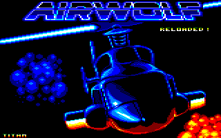
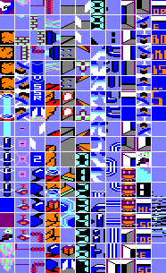

# Airwolf Reloaded

**Autopsie d'un jeu maudit de l'Amstrad CPC**



---

## L'histoire

Lors d'une periode ou le corps lache avant l'esprit, le sommeil peut devenir inaccessible. C'est ce qui m'est arrive pendant une periode de sante difficile - des nuits entieres a chercher une stimulation mentale. Plutot que de sombrer dans l'inactivite, j'ai poursuivi une enquete inhabituelle : decouvrir ce qui se cachait au-dela du niveau 2 du jeu Airwolf sur Amstrad CPC.

## Un jeu mythique... pour les mauvaises raisons


Airwolf possede un statut legendaire dans la communaute Amstrad - tristement celebre pour etre frustrant et apparemment impossible a terminer. La plupart des joueurs ne depassaient pas quatre ecrans. Ceux qui allaient plus loin rencontraient systematiquement un crash dans ce qui aurait du etre la zone finale.

Intrigue par ce "bug", j'ai decide de faire du reverse-engineering du jeu pour decouvrir ce qui se cachait derriere.

## Plongee dans le code


En utilisant l'emulateur WinAPE et son debugger, j'ai :

- Desactive les collisions pour atteindre rapidement la zone problematique
- Decouvert que le crash n'etait pas accidentel - le code entrait deliberement dans une boucle infinie
- Reverse-engineere l'integralite du code
- Etabli la carte memoire complete
- Compris toutes les structures de donnees

## La revelation : le niveau 2 n'existe pas


La decouverte la plus frappante : **le niveau 2 n'existait tout simplement pas**. Le jeu reposait sur une unique tilemap contenant tous les ecrans, sans chargement en cours de partie, et pourtant elle restait a moitie inutilisee.

Le systeme de progression dependait d'interrupteurs : en activer un declenchait des fonctions selon l'ecran courant. La salle finale contenait deux interrupteurs - impossibles a activer par design.

### La boucle infinie a l'adresse #698A

```asm
EXECUTE_BUTTON_ACTION:              ; #6971
    LD A,(VIEW_INDEX)               ; Charge la zone actuelle
    ...
    CP #08                          ; Zone 8? (zone finale)
.infinite:
    JP Z,.infinite                  ; #698A - BOUCLE INFINIE!
```

Quand `VIEW_INDEX` vaut 8 (la zone finale), le jeu entre dans une boucle sans fin. Ce n'est pas un bug - c'est intentionnel.

## Particularites techniques

### La palette et les couleurs magiques


Le systeme de collision testait chaque pixel de l'helicoptere contre les couleurs du fond - pas de boites englobantes. La logique de collision reposait en fait sur les indices de palette, creant de nombreuses couleurs dupliquees dont certaines semblaient sans utilite.


Le **cyan** est la couleur cle : elle determine ce qui peut etre detruit ou active.


### Les sprites


*Les 7 frames de rotation de l'helicoptere*


*L'animation d'explosion*

### Le tileset complet



238 tiles de 16x16 pixels composent l'univers graphique du jeu.

### Du code abandonne

Des fragments de code de scrolling inutilises suggerent que le developpeur avait initialement concu un jeu a scrolling continu avant de passer a un deplacement ecran par ecran.

Le code semblait assemble a partir des contributions de plusieurs developpeurs, avec certaines routines convertissant inutilement des structures, introduisant des bugs visuels des la premiere frame. Le player musical contenait trois canaux mais ignorait completement le troisieme.

## Un jeu bacle


*La zone 8 - l'ecran que les joueurs n'atteignent jamais*

Toutes les preuves pointent vers un developpement precipite sous la pression de la licence, necessitant un refactoring profond pour avoir de la coherence.

## Reflexion personnelle

Apres cette enquete approfondie, j'ai developpe une veritable affection pour le developpeur original. Le code revelait des intentions, des compromis, de la fatigue, de l'urgence - et peut-etre de la passion.

## Les projets nes de cette enquete

### Airwolf Pico

Une reimagination sur PICO-8 refletant ma vision de ce qu'aurait pu etre le jeu.

### Airwolf Reloaded by Titan

Une version Amstrad debuggee avec des graphismes reimagines. Le patch principal : remplacer les 3 octets de la boucle infinie (`CA 8A 69`) par 3 NOPs (`00 00 00`).

## Ce que j'ai appris

Plus important encore, cette enquete apparemment inutile m'a soutenu pendant la maladie, me rappelant que la curiosite, aussi apparemment futile soit-elle, peut devenir essentielle.

---

## Fichiers du projet

| Fichier | Description |
|---------|-------------|
| `source-airwolf` | Code source assemble commente |
| `64e8-8560-full-code.asm` | Desassemblage brut du binaire original |
| `AIRWOLF_LE_LIVRE.md` | Livre complet d'analyse technique |
| `AIRWOLF_LE_LIVRE.pdf` | Version PDF du livre |
| `AIRWOLF_ANALYSIS.md` | Document d'analyse detaillee |
| `AIRWOLF_ADDRESSES_REFERENCE.md` | Reference des adresses du code |

## Structure memoire

```
#0000-#03E7 : Zone systeme Z80
#03E8-#14E7 : TILEMAP (4352 octets)
#14E8-#4F67 : TILESET (238 tiles)
#4F68-#4FFF : Sprites pales helicoptere
#5000-#5FFF : Sprites explosion
#6000-#64E7 : Buffer scrolling
#64E8-#68A7 : Donnees musique
#68A8-#80FF : Code programme
#8100-#A3FF : Buffer ecran suivant
#C000-#FFFF : VRAM (16 Ko)
```

## Outils utilises

- **WinAPE** : Emulateur Amstrad CPC avec debugger integre
- **RASM** : Assembleur Z80

---

*Projet base sur l'analyse du jeu Airwolf (Elite Systems, 1985)*

*Par Alain Le Guirec - Decembre 2025*
